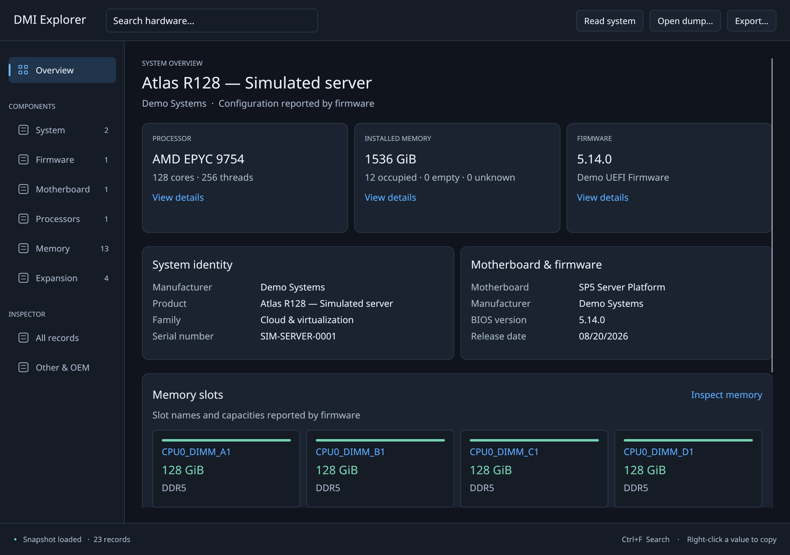
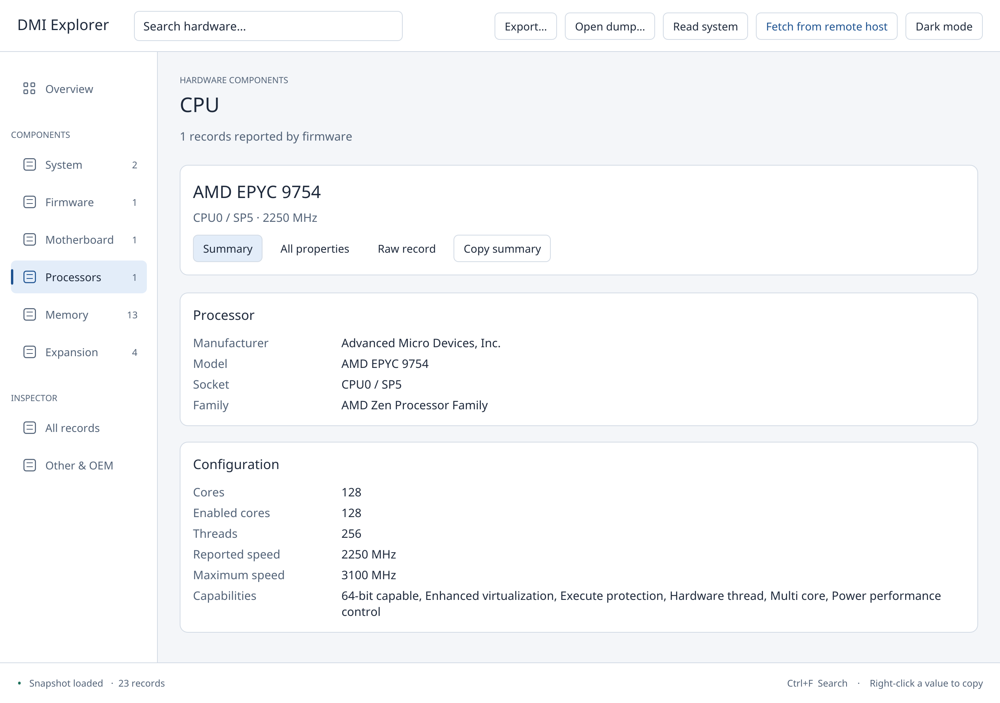

# DMI Explorer

**A clear view of your machine’s hardware, straight from its firmware.**

DMI Explorer is a native Rust desktop application for browsing SMBIOS hardware
inventory. See your system configuration at a glance, inspect individual memory
modules and processors, and drill down to the original firmware records when
you need the details.

Built with **egui/eframe** and **dmidecode-rs**, it reads hardware through a shared
Rust library and also opens saved binary dumps for offline inspection.

## A server-sized preview



*Actual application screenshot using entirely synthetic SMBIOS data. The Atlas
R128 is a fictional server; all machine identifiers, board information, and
firmware versions are invented.*

| Demo configuration | Simulated hardware |
| --- | --- |
| Processor | AMD EPYC 9754 · 128 cores / 256 threads |
| Memory | 1.5 TiB · 12 × 128 GiB DDR5-4800 ECC RDIMMs |
| Platform | Single-socket SP5 server in a 2U rack enclosure |
| Expansion | Four PCIe expansion-slot records |

The CPU configuration follows [AMD’s published EPYC 9754 specifications](https://www.amd.com/en/products/processors/server/epyc/4th-generation-9004-and-8004-series/amd-epyc-9754.html).
This preview is an inventory demonstration, not a benchmark or a claim of
validation on that physical hardware.

<details>
<summary><strong>Look inside the processor view</strong></summary>



Grouped specifications keep the important information readable. The complete
JSON and binary record remain available in the raw inspector.

</details>

## What you can explore

- **System overview** — processor configuration, installed memory, system identity,
  motherboard, and firmware in one place.
- **Memory layout** — see each reported slot, its capacity, and whether it is
  populated, empty, or unknown.
- **Component details** — grouped specifications with readable names and units,
  while preserving firmware-supplied identifiers.
- **Record inspector** — examine every SMBIOS record, decoded JSON, raw bytes,
  strings, and supported vendor-specific OEM data.
- **Search and copy** — find models, serials, handles, or displayed values such
  as “128 GiB”; copy individual values or a complete summary.
- **Remote servers** — fetch Linux firmware over SSH using existing keys and
  host aliases, with no remote installation.
- **Offline inspection and export** — open a saved binary dump and export the
  decoded inventory as JSON.

## Build and run

```sh
git clone git@github.com:nuclearcat/dmidecode-gui.git
cd dmidecode-gui
cargo run
# Preview with synthetic data; no firmware access required:
cargo run -- tests/fixtures/server.bin
# Open a saved SMBIOS binary dump:
cargo run -- /path/to/smbios.bin
# Optimized standalone executable:
cargo build --release
./target/release/dmidecode-gui
```

Built and tested with Rust 1.97.1. Requires a desktop graphics session. On Linux,
Wayland and X11 are supported through OpenGL. File dialogs use the desktop portal
(`xdg-desktop-portal` and your desktop's portal backend). A C linker and platform
development libraries are required to build eframe.

## Remote Linux servers over SSH

Click **Fetch from remote host** on the main toolbar, enter a host alias or
`user@host`, and select **Fetch inventory**. An optional port overrides your SSH configuration.
Enable **Use sudo** if the remote account needs elevated access to firmware.

You can also launch a remote inventory directly:

```sh
cargo run -- --ssh admin@server
cargo run -- --ssh production-alias --port 2222 --sudo
```

The GUI uses your local OpenSSH client, `~/.ssh/config`, keys, SSH agent, and
configured jump hosts. Authentication must work without an interactive password
prompt. For a new host, connect once in a terminal and verify its host key first;
the GUI does not automatically accept unknown keys.

The only remote command is:

```sh
cat /sys/firmware/dmi/tables/smbios_entry_point /sys/firmware/dmi/tables/DMI
# With Use sudo enabled:
sudo -n cat /sys/firmware/dmi/tables/smbios_entry_point /sys/firmware/dmi/tables/DMI
```

No decoder, agent, script upload, remote temporary file, base64 conversion, or
listening port is needed. SSH carries the binary stdout directly into memory.
The local decoder validates the entry point, preserves the SMBIOS version, and
checks record boundaries before displaying the remote snapshot.

The remote Linux kernel must expose these firmware files, and the SSH account
must be allowed to read them. When using sudo, that exact read must be permitted
without a password. Systems requiring a TTY or interactive sudo are not supported.

Reads have a 45-second overall timeout and can be cancelled in the status bar.
Failed reads keep the previous inventory visible. Remote transfers are limited
to 16 MiB; SSH diagnostics are limited to 32 KiB. The status bar identifies the
remote source, and exporting JSON remains an explicit action.

## Navigation and data

Ctrl+F focuses search; Escape clears it. Right-click a specification value to
copy it. The record browser adapts between a list/detail layout and a compact
selector according to window width.

Unknown memory capacities are excluded from the explicitly labeled known total.
JSON export preserves the dmidecode-rs CLI schema; OEM extensions are displayed
separately.

## Firmware access

Firmware reading runs on a worker thread. On Linux, **Read system → Read with
administrator access…** uses `pkexec` to run a separate reader process. The GUI
continues running as your normal user. This requires polkit and a desktop
authentication agent; no policy is installed automatically.

Saved SMBIOS binary dumps can be opened without administrator access, provided
your user can read the file. The GUI links directly to the vendored decoder;
it does not require a dmidecode-rs CLI executable or a sibling checkout.

## Development and verification

```sh
cargo test --workspace
cargo clippy --no-deps -- -D warnings
```

Tests cover library loading and OEM decoding, readable units, memory capacity,
search, selection, error handling, and rendering at supported window widths.
The test fixtures contain synthetic data, not real machine inventories.

Regenerate the server fixture deterministically with:

```sh
cargo run --example generate_server_fixture
```

The optional screenshot feature captures only the app window after rendering
settles and closes the app after saving:

```sh
cargo build --features screenshots
DMI_SCREENSHOT_TO=/tmp/dmi-overview.png ./target/debug/dmidecode-gui tests/fixtures/server.bin
```

Use `DMI_SCREENSHOT_CATEGORY=0` through `7` for a component/inspector page and
`DMI_SCREENSHOT_WIDTH=900` for the minimum width. These switches only apply to
builds with the screenshot feature.

## Licensing and dependencies

The GUI is MIT licensed. The dmidecode-rs library source is included under
`vendor/dmidecode-rs`, with its upstream license and provenance. It includes the
library refactor needed by this GUI; see the vendored README for details.

Noto Sans is bundled for consistent readable text. Its SIL Open Font License
is included in `assets/FONT-LICENSE.txt`.
